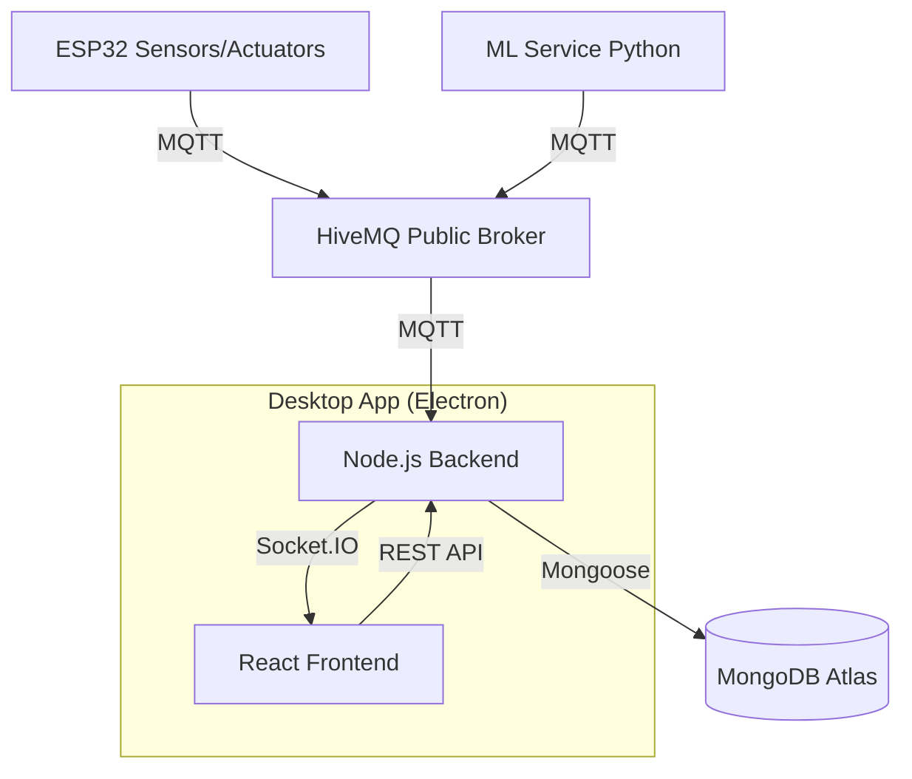

# AquaSense360 — Project Handover Report

**Project Name:** AquaSense360 (IoT Smart Fish Health Monitoring System)  
**Status:** Build-ready / Installer-ready  
**Date:** February 25, 2026

---

## 1. System Overview
AquaSense360 is an end-to-end IoT solution for monitoring fish health and automating aquarium maintenance. It integrates hardware (ESP32), cloud services (MongoDB Atlas), real-time communication (MQTT/WebSockets), and Artificial Intelligence (YOLO/SciKit-Learn) into a unified desktop application.

### Key Features
- **Real-time Monitoring:** Temperature, pH, Turbidity, TDS, and CO2.
- **Automation:** Smart feeding, Oxygen pump control, and Filter management.
- **AI Health Detection:** Vision-based fish disease detection and feeding optimization.
- **Reporting:** Historical trends and automated alerts.
- **Installer:** "Full Pack" Windows desktop application including ML engine.

---

## 2. Architecture Diagram



---

## 3. Technology Stack & Dependencies

### 3.1 Backend (Node.js/Express)
The core logic layer handling data persistence, business rules, and gateway services.
- **Directory:** `/backend`
- **Port:** 5000
- **Main Dependencies:**
  | Library | Version | Purpose |
  |---------|---------|---------|
  | `express` | ^4.18.2 | Web framework |
  | `mongoose` | ^8.0.3 | MongoDB ODM |
  | `socket.io` | ^4.6.1 | Real-time WebSocket server |
  | `mqtt` | ^5.3.4 | MQTT client for broker communication |
  | `cors` | ^2.8.5 | Cross-origin resource sharing |
  | `dotenv` | ^16.3.1 | Environment variable management |
  | `nodemon` | ^3.0.2 | Dev-mode auto-reload |

### 3.2 Frontend (React)
The visualization layer providing a premium dashboard experience.
- **Directory:** `/frontend`
- **Building Tool:** Create React App (CRA)
- **Main Dependencies:**
  | Library | Version | Purpose |
  |---------|---------|---------|
  | `react` | ^19.2.4 | UI library |
  | `react-router-dom` | ^7.13.0 | Routing |
  | `axios` | ^1.13.4 | HTTP client |
  | `chart.js` | ^4.5.1 | Data visualization |
  | `react-chartjs-2` | ^5.3.1 | React chart wrapper |
  | `socket.io-client` | ^4.8.3 | Real-time WebSocket client |

### 3.3 ML Service (Python)
Artificial Intelligence service for disease detection and predictive analytics.
- **Directory:** `/ml-service`
- **Python Version:** 3.9+ recommended
- **Key Libraries:**
  | Library | Version | Purpose |
  |---------|---------|---------|
  | `ultralytics` | ^8.0.0 | YOLOv8 disease detection |
  | `scikit-learn` | ^1.7.0 | Predictive modeling |
  | `opencv-python` | ^4.8.0 | Image processing |
  | `paho-mqtt` | 1.6.1 | MQTT communication |
  | `pandas` / `numpy` | >=2.0.0 | Data processing |
  | `flask-cors` | ^4.0.0 | API middleware |

### 3.4 Desktop Shell (Electron)
Wraps the project into a single Windows installer.
- **Root Directory:** `/`
- **Dependencies:**
  | Library | Version | Purpose |
  |---------|---------|---------|
  | `electron` | ^33.3.1 | Native shell |
  | `electron-builder` | ^25.1.8 | Installer packaging |
  | `concurrently` | ^8.2.2 | Running multiple processes |

---

## 4. Communication Protocol Details

### 4.1 MQTT Topics
| Topic | Publisher | Description |
|-------|-----------|-------------|
| `aquasense/esp32/sensors` | ESP32 | Periodic sensor readings (JSON) |
| `aquasense/esp32/cmd/*` | Backend | Control commands for actuators |
| `aquasense/ml/fish-disease`| ML | Detection results |
| `aquasense/ml/status` | ML | Health heartbeat of ML service |

---

## 5. Handover Checklist & Setup

### 5.1 Environment Configuration
Ensure `.env` files are updated in both `/backend` and `/frontend` directories.
- **Backend:** Needs `MONGO_URI` (Atlas) and `MQTT_URL`.
- **Frontend:** Needs `REACT_APP_API_URL` and `REACT_APP_SOCKET_URL`.

### 5.2 Building the Installer (Production)
```bash
# 1. Install root dependencies
npm install

# 2. Build local packages
npm run build:frontend
npm install --prefix backend

# 3. Create Windows Installer
npm run dist
```
The output `.exe` will be located in the `/dist` folder.

---

## 6. Critical Notes for Successors
- **MongoDB:** Using Atlas (Cloud). Ensure IP access is allowed in the Atlas dashboard.
- **MQTT Broker:** Currently using HiveMQ Public Broker. For commercial use, switch to a private broker (AWS IoT or private HiveMQ instance).
- **Video Stream:** The app expects a stream from a Raspberry Pi or Local Camera. You can also use a **mobile phone** as a camera using apps like DroidCam (see below).
- **Mobile Camera Setup:** Install DroidCam on your phone, then in the ML service command interface, type: `camera http://<your-phone-ip>:4747/video`.
